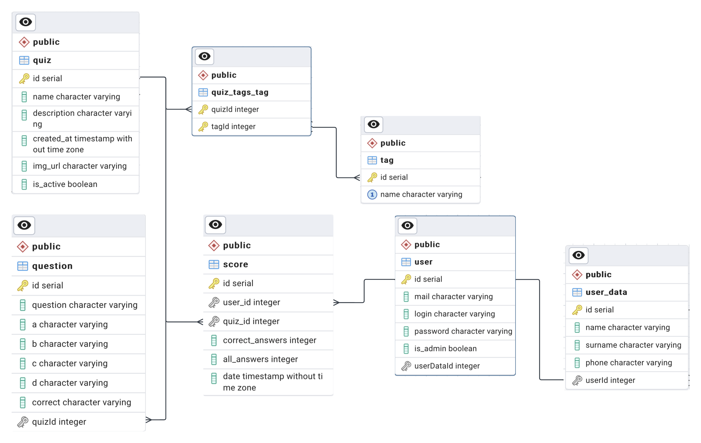
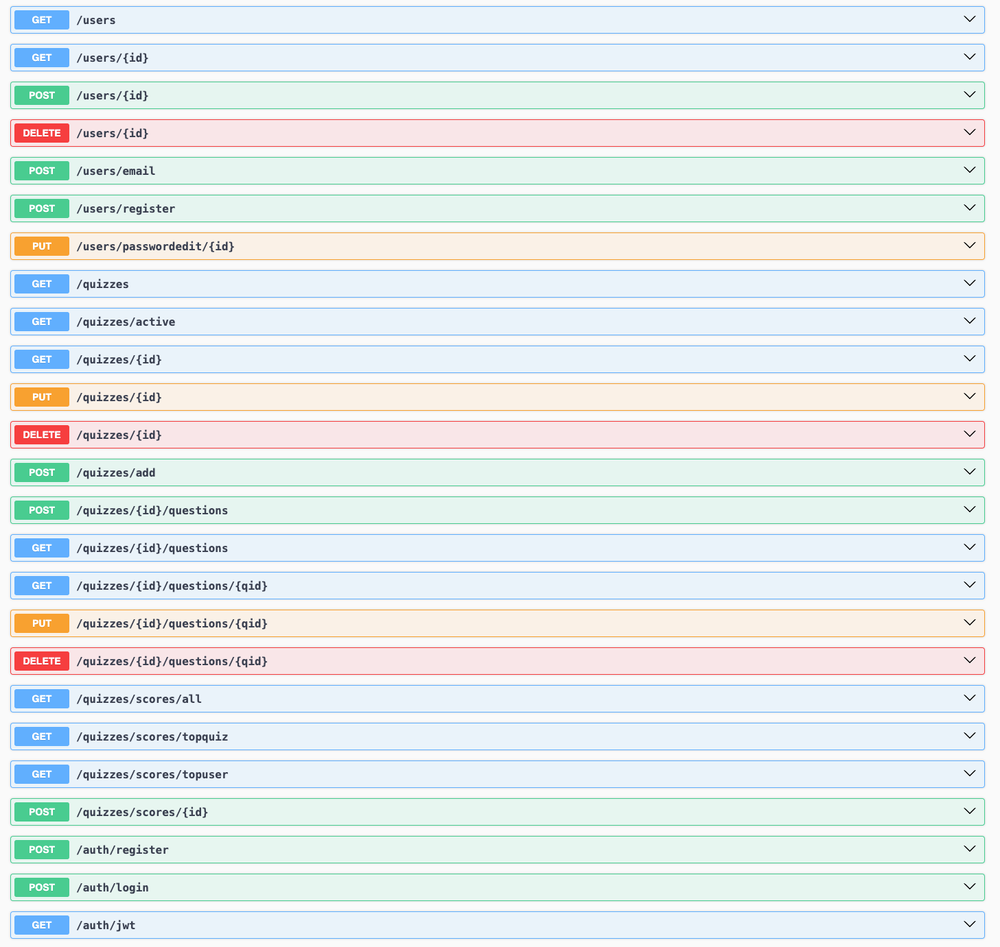

# QZZY

Projekt prostej aplikacji do przeprowadzania quizów. 
---

## technologie:
- nest.js
- postgresql
- js
- html
- css
---

## Działanie:
Aplikacja umożliwia użytkownikom branie udziału w quizach na różne tematy. 
Aplikacja zapewnia zarówno użytkownikom, jak i administratorom funkcjonalności dostosowane do ich potrzeb. Oto kilka kluczowych cech aplikacji:

- Rejestracja i logowanie: Użytkownicy mogą utworzyć swoje konta, korzystając z formularza rejestracyjnego, a następnie zalogować się do aplikacji. To pozwala na personalizację doświadczenia i zapamiętanie wyników quizów.
- Przeglądanie dostępnych quizów: Po zalogowaniu użytkownicy mają dostęp do listy dostępnych quizów. Użytkownicy mogą przeglądać quizy i wybierać te, w których chcą wziąć udział.
- Udział w quizach: Po wybraniu quizu użytkownicy mają możliwość rozpoczęcia udziału. Quiz może składać się z pytań jednokrotnego wyboru (a,b,c,d), nie istnieje limit czasowy ani ilość dozwolonych prób.
- Wyniki quizów: Po zakończeniu quizu, użytkownik otrzymuje wynik swojego podejścia poprawne/wszystkie. Wyniki widnieją na scoreboardzie, do któego ma dostęp użytkownik.
- Administratorzy i tworzenie quizów: Aplikacja umożliwia administratorom tworzenie quizów. Administratorzy mają dostęp do panelu administracyjnego, w którym mogą dodawać nowe pytania, edytować istniejące quizy, zarządzać użytkownikami.

### Użytkownik:
- bierze udział w quizach,
- ma możliwość zobaczenia scoreboarda'a

### Administrator:
- ma dostęp do większej ilości paneli niz użytkownik
- tworzenie użytkowników
- tworzenie quizów
- modyfikacja quizów i użytkowników
- reszta uprawnień jak użytkownik

### ERD:
  

### Endpointy:
  